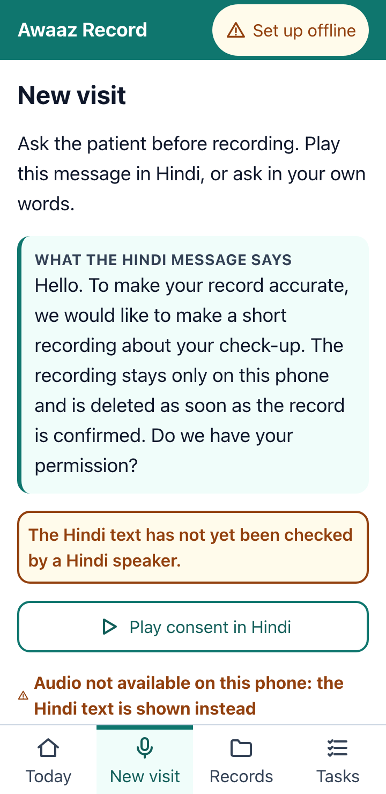
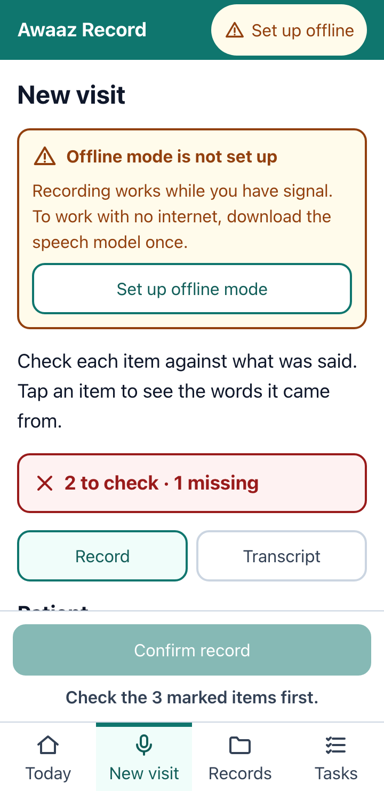
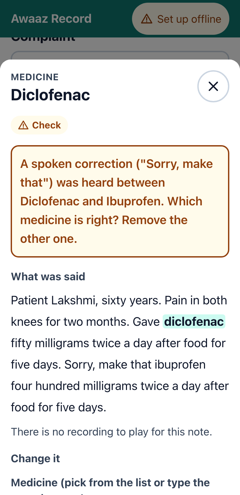
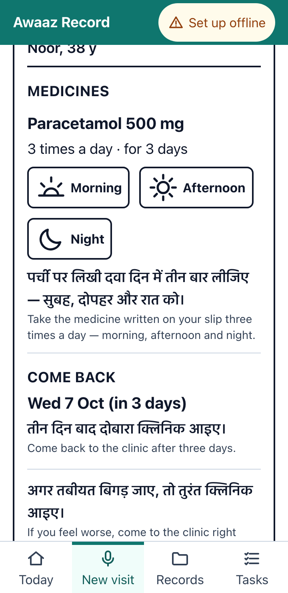
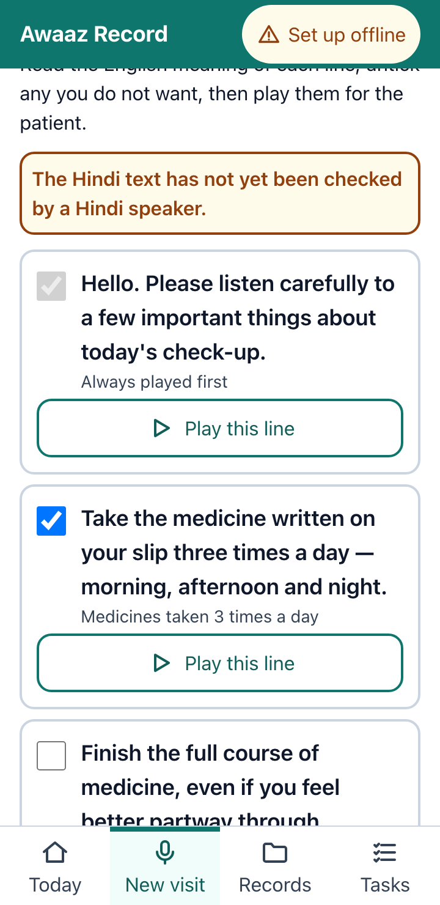
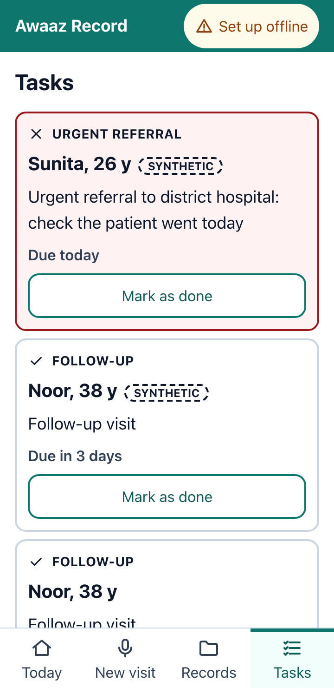
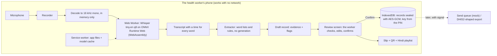

# Awaaz Record

**Speak the visit note. Check it. Hand the patient a slip, and a voice she understands.**

An offline phone app for a clinic health worker. She speaks a 20 to 60 second note in English. The phone writes it down on the device, fills a fixed visit record where every value points back to the words it came from, and asks her about anything it is unsure of. When she has checked and confirmed, the record is saved locked with her PIN, and the patient leaves with a printed slip (medicine times drawn as icons, return date, a QR code) and hears her instructions in Hindi.

Built solo for the Hack-Nation × World Bank *Small AI for Development* hackathon, **Health** track (ps.pdf Annex A). Challenge: help a frontline worker serve a patient like Noor better, without diagnosing anything.

- **Live app:** https://shivanshyyy.github.io/awaaz-record/ (it goes live when GitHub Pages is switched on for this repo; see [Deploy](#deploy))
- **Code:** https://github.com/Shivanshyyy/awaaz-record
- **Try it in two minutes:** open the app in Chrome on an Android phone, tap *Set up offline* once on Wi-Fi, then *Records → Load 3 demo visits (SYNTHETIC)* and open one to see the review, the slip and the Hindi instructions. Add `?dev=1` to the address to paste a transcript instead of recording.

<table>
<tr>
<td></td>
<td></td>
<td></td>
</tr>
<tr>
<td></td>
<td></td>
<td></td>
</tr>
</table>

## The problem, in one sentence

> Because of this tool, a primary health centre worker in India will finish a checked, structured record of the visit and give the patient a slip with medicine times and a return date, plus a Hindi voice message, before the patient leaves the room, work she would otherwise write up by hand afterwards, in a hurry, or skip; we know the problem is real because consultations in India are very short, the health ministry itself calls for cutting the burden of work on health functionaries, and patients forget much of what they are told ([sources](#sources-i-opened)).

What the evidence shows is the *problem*. It does not show that this tool fixes it: **nobody has timed a real worker using it yet**, and speech recognition has not been tested on voices from our own setting. The only real human speech measured so far is a small outside set of UK clinicians (see [Evaluation](#evaluation)).

## Where it sits in the worker's day

1. **Once, at the clinic on Wi-Fi:** she opens the app and taps *Set up offline*. A one-time download of the speech model (shown on screen: 66.1 MB) is saved on the phone. After that nothing needs a network.
2. **A patient comes in.** She plays the Hindi consent message (the screen shows what it says in English) and taps *Patient agreed*, or *Patient declined*, in which case nothing is recorded and she types the record herself.
3. **After examining the patient** she presses record and speaks the note: name, age, complaint, readings, medicines, advice, referral, follow-up.
4. **The phone transcribes it on the device** (about a second or two on a laptop; the app shows progress) and fills the visit record. Every value shows the exact words it came from, with a play button for that part of the recording.
5. **She checks.** Anything the app is unsure of is amber or red, in words, as a question: *"Dose not heard for ORS: what was given?"* She taps *Looks right*, corrects it, or marks it *Not applicable*. **Confirm stays disabled until nothing is amber or red.**
6. **Confirm.** The record is saved, locked with her PIN. The recording is deleted. The follow-up and any referral become tasks.
7. **The patient leaves with a slip**: first name and age, each medicine with Morning / Afternoon / Night icons (with the words), the return date, the hospital to go to, a Hindi line under each item, and a QR code with a short plain-text summary. The Hindi instructions are played from a list she has read first.
8. **Later, with signal:** records waiting to be sent show as *"3 waiting for signal"*. (Sending is a labelled mock in this prototype.) Follow-ups appear in *Tasks*, urgent referrals first.

## What the AI does, and why a simpler tool would not do the same job

**The AI part is one thing: speech recognition.** A small English Whisper model (`whisper-tiny.en`, 39 million parameters according to its model card) runs inside the browser on the phone and turns the spoken note into text with a time for every word. Everything after that is deliberately **not** generative: plain rules and fixed word lists find the patient, complaint, readings, medicines, advice, referral and follow-up in the text, and each answer is a list entry, a number, or words copied from the transcript.

Why not something simpler?

- **SMS** moves messages. It cannot turn a spoken note into a checked record, and it needs a signal at the moment of the visit.
- **A spreadsheet** needs a clinic worker to type about twenty fields on a phone, in a visit that lasts minutes, and it checks nothing and links nothing to what was said.
- **A web search** finds general information. It does not know this patient.
- **A form with tick-boxes** could capture the same fields without any AI. That is the honest comparison. Speech adds speed and free hands: a 30 second spoken note instead of filling every field. **We have not timed workers**, so that remains a design hypothesis, not a result.

### Guardrails (ps.pdf p.7 and p.11: a person makes the final call; avoid hallucinations; "not sure, ask a person")

| Rule | How it is enforced | Where to see it |
|---|---|---|
| **No diagnosis, no clinical advice** | The record holds only what the worker said. Checks are about completeness and impossible numbers (a temperature of 150), never about whether a treatment is right. The app never suggests a condition, drug or dose. | `src/extract/`, `src/extract/flags.ts` |
| **A fixed list of answers** (ps.pdf glossary) | The extractor fills a fixed schema. A test walks every record built from 23 transcripts and fails if any string is not a lexicon entry, a fixed answer, or copied from the transcript. | `src/extract/no-generated-text.test.ts` |
| **Every value has evidence** | Each value carries the character span of its source words and, from a recording, the time span; the worker can play it. | review screen, `src/record/schema.ts` |
| **A person makes the final call** | Confirm is disabled while any field is amber or red. Nothing is auto-confirmed. "Looks right" is not offered for something that was never heard. | `e2e/review.spec.ts` |
| **Flag, don't guess** | A garbled medicine name is snapped to the closest drug only with a question; if two are equally close, neither is picked. A spoken correction ("sorry, make that…") keeps both medicines and asks. Impossible numbers are flagged. | `src/extract/fields/medications.ts` |
| **Hindi is never written by the app** | The 23 patient lines are copied out of `docs/HINDI_CLIPS.md` by a script, and a test checks they match character for character. | `scripts/build-hindi-clips.mjs` |
| **A stuck model is caught** | Small speech models sometimes repeat one phrase until they run out of room. The transcript is cut where the loop starts and a warning is shown. | `src/asr/transcript.ts` |
| **Offline, nothing leaves the phone** | Model files and the ONNX runtime are served from the app's own origin. A browser test goes offline and fails on any request to another host. | `e2e/journey.spec.ts` |

The model's own card says it is *"not appropriate"* for *"decision-making contexts, where flaws in accuracy can lead to pronounced flaws in outcomes"*, and that it can hallucinate and repeat text. We use it only to **draft** a record that a person then checks, we make no decision from its output, and we cut repetition loops. That is a mitigation, not a cure: on the synthetic test audio some wrong values still look fine (see [Evaluation](#evaluation)), which is why the review step, and a one-tap *Hear it* on the name and age, exist.

## Architecture and stack



React 19 · TypeScript (strict) · Vite 7 · Tailwind 4 · `vite-plugin-pwa` (service worker) · `@huggingface/transformers` 3.8 running Whisper tiny.en (q8) in a Web Worker · `idb` + WebCrypto (PBKDF2 → AES-GCM) · `qrcode` · Vitest · Playwright + axe-core · GitHub Pages through GitHub Actions. No server, no database, no account.

## Data: what we use, and what it does not cover

ps.pdf (p.8) asks for every dataset, its source, licence and size, and says that stating **what the data does not cover is scored**.

| What | Source | Licence | Size | Used for |
|---|---|---|---|---|
| Speech model `whisper-tiny.en`, ONNX q8 conversion `Xenova/whisper-tiny.en` at revision `79fb389f` | OpenAI (model); conversion on Hugging Face | Apache-2.0 (model card) | 44.5 MB with tokenizer files (printed by `npm run fetch-models`) | Speech to text on the phone |
| ONNX Runtime Web 1.22 (WebAssembly build) | Microsoft, bundled with Transformers.js | MIT | 21.6 MB | Runs the model in the browser |
| Transformers.js 3.8.1 | Hugging Face | Apache-2.0 | inside the 868 kB worker script | Loads and runs the model |
| Drug word list: 90 generic names, 126 spellings | Hand-compiled by the builder; selection guided by the WHO Essential Medicines list and India's NLEM, but **not copied or checked line by line against either** | ours | a few KB | Recognising medicines in the transcript |
| Symptom word list: 57 entries, 348 phrasings, incl. Indian English ("loose motions", "body ache") | Hand-compiled by the builder | ours | a few KB | Recognising complaints |
| Facility types (12) and cue words | Hand-compiled by the builder | ours | tiny | Referrals, negation, corrections |
| 10 scripted visit notes with gold answers (`eval/scripts.json`) | Written for this hackathon, **synthetic**, no real patients | ours | 10 KB | Testing the extractor and speech |
| TTS-synthetic audio (13 clips, git-ignored) | The Indian-English voice "Tara" on macOS, plus synthetic noise at 10 dB signal-to-noise | not distributed | 5.3 MB | A pipeline check only |
| My own voice recordings | The builder's voice, from `docs/RECORDINGS.md` | not yet recorded | n/a | **pending recordings** |
| PriMock57: the clinician channel of 5 of its 57 mock primary-care consultations (9 utterances scored) | Babylon Health; Papadopoulos Korfiatis et al., ACL 2022; https://github.com/babylonhealth/primock57 at commit `cd2ac707` | CC BY 4.0 (credit above; we cut utterances and normalised text for scoring) | 88.1 MB downloaded by `npm run fetch-primock` (git-ignored, not in the app) | An outside check of speech recognition on real clinicians, UK English; the extractor is not run on it |
| 23 patient lines in Hindi (`docs/HINDI_CLIPS.md`) | Written before this build, **not yet checked by a Hindi speaker** (the app says so on screen) | ours | text only; audio files not yet made | Consent message, slip lines, instructions |

ps.pdf lists common speech datasets (Common Voice, FLEURS, IndicVoices and others); we **did not use them**: Whisper tiny.en is English only, and we did not fine-tune.

### What our data does not cover

- **No real patient, no real clinic, no real field audio.** Every transcript in the extraction tests was typed by the builder or made by a computer voice reading a script. The one outside test (PriMock57) is real clinicians speaking, but in acted consultations in UK English, and it checks speech recognition only.
- **One speaker's scripts.** Ten notes by one author, in one style. Real notes are messier, longer and less ordered.
- **English only on the speech side.** No Hindi or Hinglish dictation, no other Indian language, and nothing for a worker who is more comfortable in another language.
- **Accents, ages and voices.** Whisper's own card warns of *"disparate performance on different accents and dialects"*. We tested one synthetic Indian-English voice, and nine utterances of UK clinicians. No Indian-accented human speech, no children's or elderly voices, no whispered or rushed speech, no phone-call quality.
- **Noise.** Only synthetic noise added to three clips. No fans, crying babies, generators or a waiting room.
- **A phone.** Timings and tests are from a laptop (Apple M5 Pro). The app has not yet been run on a real low-end Android phone.
- **Medicines.** 90 generic names and a handful of brand names (such as Dolo, Crocin, Calpol). Combination tablets, injections, local brand names, traditional medicine and spelling variants outside the list will not be recognised; the app then asks "which medicine was it?".
- **Complaints.** 57 entries. Anything else is shown exactly as heard with a question, never mapped to a code.
- **India only.** Facility types, Hindi and the follow-up wording are for an Indian primary health centre.
- **The Hindi.** Unchecked by a Hindi speaker, and with no audio files yet; the app falls back to the phone's own Hindi voice, then to the Hindi text.

## Bias and fairness

ps.pdf (p.13) warns of *"biases encoded in algorithms"* and of models that underperform on the populations they are deployed to. Where this could bite here, and what we did and did not do:

- **Speech recognition is the main risk.** Whisper's own card says it can show *"higher word error rate across speakers of different genders, races, ages, or other demographic criteria"*. A health worker with a strong regional accent, a woman with a soft voice, or a patient's relative speaking over the worker could be understood less well than a clear standard voice. We have **not measured this**: our only audio is one synthetic voice, so we cannot report error rates by accent, gender or age. This is the first thing a real-voice test must do.
- **Names.** Names from some communities may be heard worse than others; the transcript showed names turned into unrelated words. The app does not judge whether a name "looks right" (that would encode its own bias); it shows the name with a one-tap *Hear it* and lets the worker correct it.
- **The word lists** were written by one person from common usage. Medicines and complaints outside them, including local and traditional ones, are not recognised and are shown as heard, with a question. They are not dropped or replaced.
- **Who is left out.** A worker who dictates in another language, a patient who is deaf or does not use the language of the Hindi lines, and anyone without a recent smartphone. The slip carries icons and words, and the app works without hearing, but nothing here replaces a worker's own judgement about the patient in front of her.
- **What reduces harm:** a person confirms every record; wrong or missing values are shown as questions where the app can tell; nothing is used to rank, score or decide anything about a patient.

## Privacy: where data sits, who can read it, a lost or shared phone

- **Where:** only in the browser's storage on the worker's phone. There is no server and no cloud. **Audio is never stored**: it exists in memory while the worker reviews, and is dropped when she confirms (the consent message promises exactly this).
- **Consent comes first.** Nothing records until the patient agrees (a Hindi message, or the worker asking in another language). If she declines, no recording happens and the record is typed by hand. How consent was given is kept on the record.
- **Who can read it:** whoever knows the worker's PIN. Every record and task is **sealed with AES-GCM-256**. The key comes from the PIN with PBKDF2-SHA256 (a random salt; the number of rounds is measured on the phone, between 200,000 and 600,000), and exists only in memory. The stored data holds a random id, a timestamp and sealed bytes: **a test reads the raw database and finds no name, transcript, complaint or medicine**, and that a wrong PIN, a moved record or a single changed bit cannot be opened.
- **A lost phone:** the records are locked without the PIN. Five wrong PINs pause unlocking for 60 seconds (nothing is deleted), and the app locks itself after two minutes without a touch. **Limit, stated plainly:** these are screen-level controls. Someone who copies the phone's storage can try PINs offline, and a 4 to 6 digit PIN is a small space. A forgotten PIN cannot be recovered.
- **A shared phone:** one PIN, one vault. The slip carries only a first name and age; no surname, phone number or address appears on the slip, the QR code, the tasks or the export.
- **Sending:** "Send" in this prototype is a labelled mock with no network request at all, because ps.pdf (p.13) warns that patient data moving through a mobile network carries risks a paper record does not. The export is a file the worker chooses to create, with a warning that it contains patient details.

## Local language: Hindi

The patient (Noor) speaks Hindi; the clinic writes in English. **Hindi** is the language of the consent message, of every line on the slip, and of the instructions, as **voice and text**. These are 23 fixed lines (`docs/HINDI_CLIPS.md`), not generated speech: the app can never say anything unchecked to a patient.

How it fares in a less-supported language (ps.pdf p.7 asks): no speech model is needed for the patient's side. A community member who speaks the language records the same 23 lines in a voice tool, puts the files in a folder, and has the list checked; a new language is a new folder and a new text file. The weak spot is the **worker's** side: Whisper tiny.en understands only English, so a worker who dictates in another language would need a multilingual model (larger, slower) or a model fine-tuned on that language. For Indian languages the AI4Bharat resources named in ps.pdf are the next place to look; we did not use them.

Right now there is **no audio for the Hindi lines**. The playlist uses an mp3 if it exists, then the phone's own Hindi voice if it has one, and otherwise shows the Hindi text with "audio not available". All three paths are tested.

## Evaluation

Full tables, the method and the limits are in **[docs/EVALUATION.md](docs/EVALUATION.md)**, generated by `npm run eval` from `eval/results/latest.json`. The block below is also generated; a test fails if it differs from the results.

<!-- eval:start -->

| Test | Clips | Fields right | Wrong values (not flagged) | Expected flags raised | Word error rate |
|---|---|---|---|---|---|
| Reference text (extractor alone) | 10 | 128/128 = 100.0% | 0 (0) | 6/6 | n/a |
| TTS-synthetic speech (a pipeline check) | 13 | 105/148 = 70.9% | 43 (19) | 6/7 | 27.7% |
| My own voice | **pending recordings** | | | | |
| Outside data: real clinicians, UK English (PriMock57; speech recognition only) | 9 utterances | n/a | n/a | n/a | 28.1% |

Speech took 0.04 times the length of the audio on Apple M5 Pro (Node, a laptop, not a phone). Generated by `npm run eval` on 2026-10-04; the full tables, method and limits are in [docs/EVALUATION.md](docs/EVALUATION.md).

The last row is the only real human speech tested so far: 9 utterances from UK clinicians in acted consultations, 92 word errors in 327 words. It tests speech recognition only, and says nothing about Indian English, a noisy clinic or a phone microphone.

<!-- eval:end -->

How to read it: the first row feeds the extractor the exact words, so it tests the extraction rules alone (the ten scripts were used to build them, so it is optimistic). The second row runs a **computer-voice** recording through the real speech model; it is a pipeline check, not a claim about real speech, and the speech model makes plenty of mistakes there: names ("Noor" heard as "neuroplenty"), drug names ("paracetamol" as "ferrocyte mild"), and small words ("pulse" as "Paul's"). The extractor cannot fix a wrong transcript, so it **asks**: most wrong values come with an amber or red question. The dangerous ones are the wrong values that look fine, counted in brackets, mostly names and ages. That is the main reason the review step is mandatory, and why names and ages have a one-tap *Hear it*.

In the browser (not Node), `e2e/offline-speech.spec.ts` measures an 11.4 second clip transcribed in about 1.2 seconds, and a 14.65 second clip in about 1.2 seconds, in headless Chromium on the same laptop with the model already loaded. Phones will be slower; the app shows progress while it works. Run `npm run e2e` to see the figures it prints.

## What the tool adds as constraints

- A **smartphone with a microphone** and a recent Chrome (WebAssembly, service workers, IndexedDB).
- A **one-time download of 66.1 MB** to set up offline mode. Over a weak connection that is slow, and we have not measured download times on 2G or 3G. ps.pdf (p.13) notes that even strong tools needed 2G or 3G.
- **A review step.** The worker must check and answer every question before Confirm. We have not measured how long that takes with real workers.
- **A PIN to remember**, and no recovery for a forgotten one.
- A **printer** for the paper slip, or showing the phone screen to the patient (the slip is also viewable on screen, with the QR and the Hindi audio).
- Battery, heat and memory use on a low-end phone: **not measured**.

## Scalability and replicability

- **A new language:** a new folder of recorded lines and a new text file; the playlist rules and the slip do not change.
- **A new country or clinic type:** new word lists (drugs, symptoms, facility types), a new follow-up wording and a new clip list. The schema, checks, encryption and review screen are reusable.
- **A new sector:** the pattern (speak, extract into a fixed schema with evidence, a person checks, a printed or spoken hand-off) fits any field worker who must record and instruct.
- **Where the record goes:** an export shaped like a DHIS2 event (`docs/DHIS2_MAPPING.md`), with placeholder ids, ready for a ministry's administrator to map. Not validated against a live DHIS2 server.
- **No server to run:** the whole app is static files on any web host; one deployment serves every clinic.

## Run it, test it, reproduce the numbers

```
npm ci
npm run fetch-models   # the speech model (44.5 MB), checked by sha256 and revision
npm run dev            # http://localhost:5173/awaaz-record/   (add ?dev=1 for the paste/upload helpers)
npm test               # unit tests: extraction, numbers, privacy, slip, QR, playlist
npm run tts-audio      # computer-voice test clips into eval/tts/ (macOS: say)
npm run eval           # writes eval/results/latest.json, docs/EVALUATION.md and the block above
npm run e2e            # browser tests: offline journey, privacy, review gate, accessibility (builds first)
npm run e2e:shots      # also saves the screenshots in docs/screens/
```

Project map: `src/asr/` speech in a worker · `src/audio/` recorder · `src/extract/` word lists, rules and tests · `src/record/` schema, checks, edits · `src/store/` encryption, database, tasks · `src/patient/` slip, QR, Hindi playlist · `src/app/` screens · `scripts/` model fetch, test audio, evaluation · `e2e/` browser tests · `docs/` plan, decisions, progress, evaluation.

## Limitations and next steps

- **Real voices first.** Record the ten scripts in `docs/RECORDINGS.md`, run `npm run eval`, and the "my own voice" rows fill in. Then try a real worker on a real low-end Android phone and time the whole visit.
- **Confidence.** The speech model returns no usable confidence, so the app cannot tell when a plausible name or number is wrong. Using token probabilities to flag low-confidence names and numbers is the most valuable next step.
- **Hinglish and Indian accents.** Dictation that mixes Hindi and English, and fine-tuning for Indian-accented clinical speech (see the AI4Bharat resources in ps.pdf), would help most where the model is weakest.
- **Hindi.** A native-speaker review of the 23 lines, then audio files; one more line ("take this medicine only when you need it") is waiting for translation.
- **Speed.** WebGPU where a phone has it; multi-threaded WebAssembly would need a host that can send the right headers.
- **Sending.** A real, retrying sync to the health system's DHIS2 over HTTPS, and a decision about who holds the keys at the facility.
- **Known gaps:** the slip headings are English (new Hindi cannot be written without review); an "only when needed" medicine has no accurate Hindi line yet; the PIN protects against casual access, not against someone with a copy of the storage.

## Deploy

GitHub Actions (`.github/workflows/deploy.yml`) installs, downloads the model, runs the unit tests, builds, and publishes `dist/` to GitHub Pages at `/awaaz-record/`. The repository setting *Settings → Pages → Source* must be **GitHub Actions** once; until then the last step fails and nothing is published. The built site is about 66 MB (model, runtime and app).

## Licence

The code has no licence file yet: the author chooses one (MIT is a common choice for a project like this). The models and libraries it uses are listed with their licences in the data table above.

## Sources I opened

Problem evidence. Each source was opened and read for the specific statement below; the caveat is part of the entry.

1. **Irving G, Neves AL, Dambha-Miller H, et al. "International variations in primary care physician consultation time: a systematic review of 67 countries." *BMJ Open* 2017;7:e017902** (UK-led review, 67 countries). doi:[10.1136/bmjopen-2017-017902](https://doi.org/10.1136/bmjopen-2017-017902), open text at [PMC5695512](https://pmc.ncbi.nlm.nih.gov/articles/PMC5695512/). Average consultation length ranged from 48 seconds (Bangladesh) to 22.5 minutes (Sweden), and about half the world's population spends five minutes or less with a primary care physician. For India, Table 1 lists four studies (1979, 2005, 2013, 2015) with averages of **1.9, 1.5, 2.3 and 2.0 minutes**. *Caveats:* the paper rates these Indian studies Fair or Poor in quality, and says it did not separate rural from urban or public from private practice. It says such short consultations are likely to harm patient care and raise physician workload and stress.
2. **Ministry of Health and Family Welfare, Government of India. Press release "Health Ministry Releases *Health Dynamics of India (Infrastructure and Human Resources) 2022-23*", PIB, 9 September 2024.** [pib.gov.in](https://www.pib.gov.in/PressReleaseIframePage.aspx?PRID=2053070). As of 31 March 2023 India had 31,882 primary health centres with 40,583 doctors or medical officers (about 1.3 per centre: **our arithmetic** from the two figures, not a figure the release gives). The Union Health Secretary called for integrating the HMIS and other portals *"to reduce the burden of work of health functionaries and to ensure that the data are uploaded timely and analysed carefully."* *Caveats:* the context is reporting to government portals, not writing visit notes; and this is a press release about the publication, so we did not open the full report.
3. **World Health Organization, Global Health Observatory, indicator `HWF_0001` "Medical doctors (per 10,000)", India.** Open data API: [ghoapi.azureedge.net/api/HWF_0001?$filter=SpatialDim eq 'IND'](https://ghoapi.azureedge.net/api/HWF_0001?$filter=SpatialDim%20eq%20'IND'), read 4 October 2026. India: **9.55 per 10,000 in 2024** (9.39 in 2023; 5.85 in 2005). *Caveat:* a national average says nothing about rural primary health centres.
4. **GSMA. *Mobile Gender Gap Report 2025*, press release of 14 May 2025 (London).** [gsma.com newsroom](https://www.gsma.com/newsroom/press-release/progress-closing-the-mobile-internet-gender-gap-stalls-in-lmics-gsma-mobile-gender-gap-report-2025/). Across the 15 low- and middle-income countries studied, women are 14% less likely than men to use mobile internet, and **32% less likely in South Asia**; 885 million women there are not using it. *Caveat:* regional, about mobile internet use, not India alone and not smartphone ownership. We read it as a reason to hand the patient a printed slip and a voice message, not to rely on an app or the internet.
5. **Kessels RPC. "Patients' memory for medical information." *Journal of the Royal Society of Medicine* 2003;96(5):219-222** (review; author at Utrecht University, Netherlands). [PMC539473](https://pmc.ncbi.nlm.nih.gov/articles/PMC539473/), doi:[10.1177/014107680309600504](https://doi.org/10.1177/014107680309600504). It states that *"40-80% of medical information provided by healthcare practitioners is forgotten immediately"*, that this may explain why patients forget *"how many pills to take or the date of their next appointment"*, and reports that with spoken instructions only 14% was remembered correctly against over 80% when pictographs were used. *Caveat:* a review of mostly Western studies; not about India.

Model and challenge documents: the `openai/whisper-tiny.en` [model card](https://huggingface.co/openai/whisper-tiny.en) (licence, 680,000 hours of training audio, warnings about accents, hallucination and repetition, and about high-risk use) and the hackathon concept note (`ps.pdf`).

## Your take

*What does localising AI mean to you?* (To be written by the author before the video.)

The kit's prompts to start from: The clinic writes in English but Noor understands Hindi: what does that gap mean to you? Why does it matter that her voice never leaves the phone? What did a 40 MB model get wrong (accents, Hinglish), and what would fix that locally?
